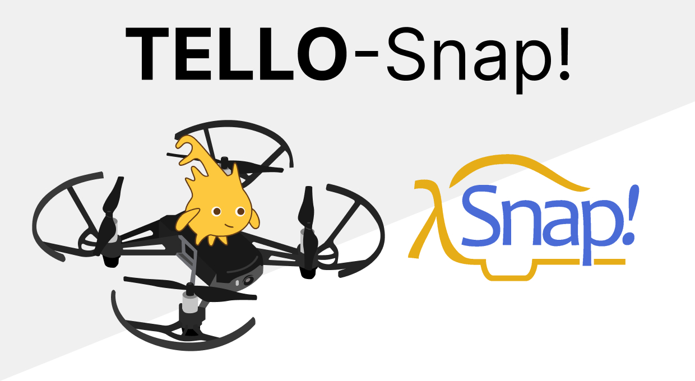
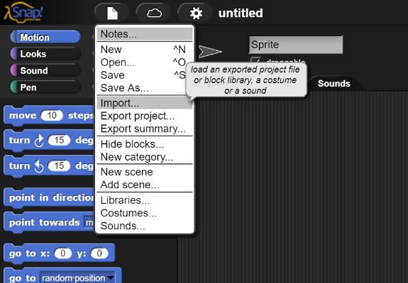
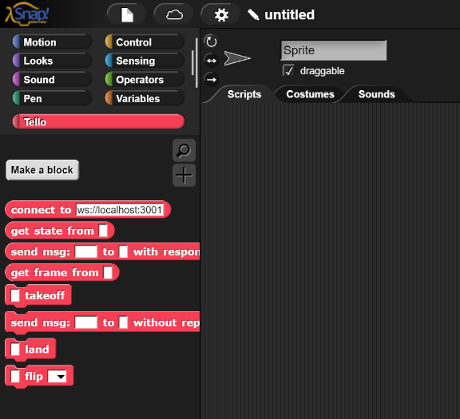

# Tello Snap!

A collection of blocks, and example projects to control Tello drone using [Snap!](https://snap.berkeley.edu/).

> ℹ️ To use these blocks you need [tello-js](https://github.com/harleylara/tello-js).

# How to import

Open **Snap!** and select import:

Select the `tello-blocks.xml` file and Done!.

ℹ️ More blocks coming soon...

# How to used

The communication between Snap! and the Tello drone is through webSockets so you need [tello-js](https://github.com/harleylara/tello-js).

TODO more details (add video?)